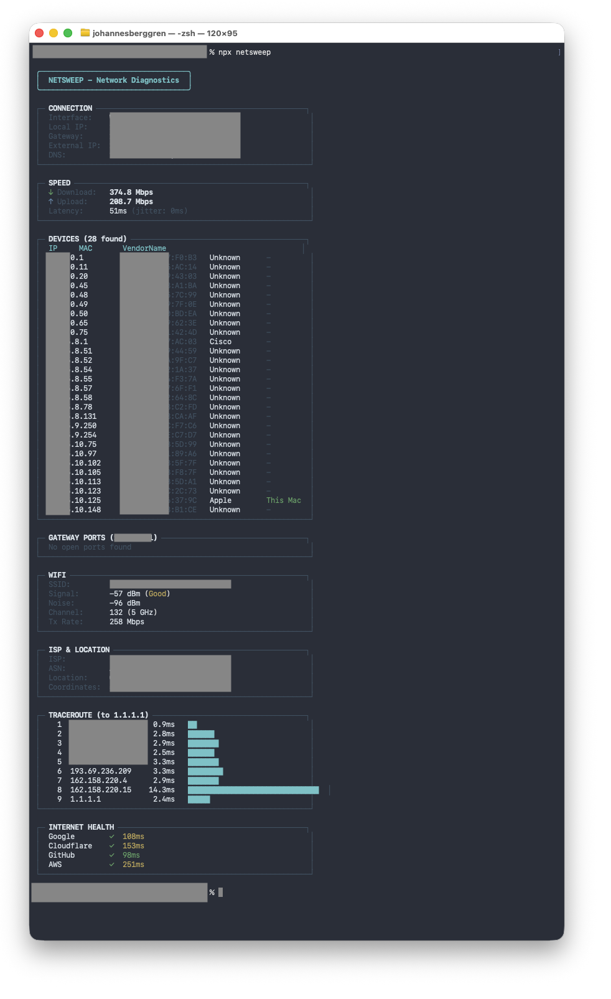

# netsweep

Network Swiss Army Knife - A single command for comprehensive network diagnostics.



## Features

- **Connection Info** - Local IP, gateway, external IP, DNS servers
- **Device Discovery** - Find all devices on your network via ARP with vendor identification
- **Speed Test** - Download/upload speeds and latency via Cloudflare
- **Port Scanner** - Scan common ports on any host
- **WiFi Info** - Signal strength, noise, channel, and transmit rate
- **ISP & Geolocation** - ISP name, ASN, and location lookup
- **Traceroute** - Visual traceroute with latency bars
- **Internet Health** - Check connectivity to major services
- **Beautiful Output** - Clean terminal UI with colors and tables
- **JSON Output** - Pipe results to other tools

## Installation

### Using Bun (recommended)

```bash
# Run directly without installing
bunx netsweep

# Or install globally
bun install -g netsweep
netsweep
```

### Using npm

```bash
# Run directly
npx netsweep

# Or install globally
npm install -g netsweep
netsweep
```

### From source

```bash
git clone https://github.com/Johannes-Berggren/netsweep.git
cd netsweep
bun install
bun link
netsweep
```

## Usage

```bash
# Full network scan (all diagnostics)
netsweep

# Individual scans
netsweep -d          # Devices only
netsweep -s          # Speed test only
netsweep -p          # Gateway ports only
netsweep -w          # WiFi info only
netsweep --isp       # ISP & location only
netsweep --trace     # Traceroute only
netsweep --health    # Internet health only

# Scan specific host
netsweep -p -t 192.168.0.7

# JSON output for scripting
netsweep --json
netsweep -d --json | jq '.devices[] | select(.vendor == "Apple")'
```

## Options

| Flag | Short | Description |
|------|-------|-------------|
| `--all` | `-a` | Run all scans (default) |
| `--devices` | `-d` | Scan for network devices |
| `--speed` | `-s` | Run speed test |
| `--ports` | `-p` | Scan gateway ports |
| `--wifi` | `-w` | Show WiFi info |
| `--isp` | `-i` | Show ISP & geolocation |
| `--trace` | `-r` | Run traceroute to 1.1.1.1 |
| `--health` | | Check internet health |
| `--target <ip>` | `-t` | Scan specific IP for ports |
| `--json` | | Output as JSON |
| `--help` | | Show help |

## Requirements

- **Bun** >= 1.0 or **Node.js** >= 18
- **macOS** (Linux support coming soon)

## How it works

- **Connection**: Uses `ipconfig`, `netstat`, and ipify.org API
- **Devices**: Parses the ARP table with MAC vendor lookup (1000+ vendors)
- **Speed**: Tests against Cloudflare's speed test endpoints
- **Ports**: TCP connect scan on common service ports
- **WiFi**: Reads from macOS system_profiler
- **ISP**: Queries ip-api.com (free, no API key required)
- **Traceroute**: Runs native traceroute command
- **Health**: HTTP HEAD requests to major services

## License

MIT
